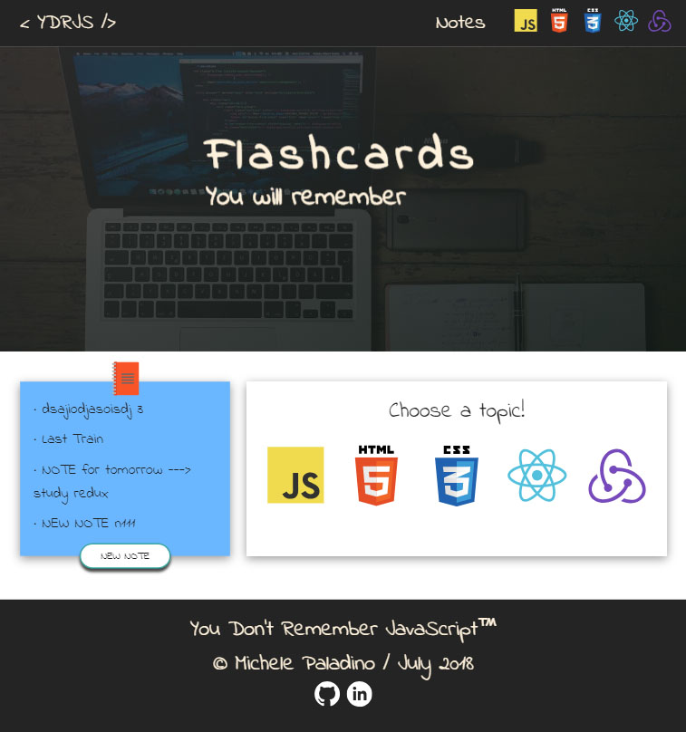
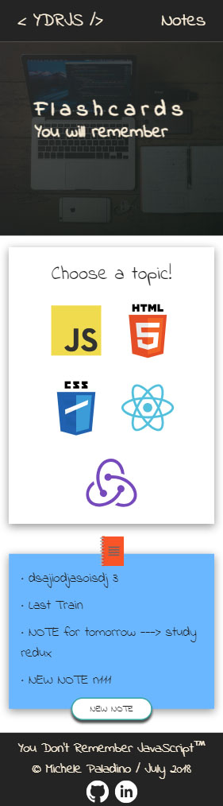

# [You Don't Remember JavaScript &rtrie;](https://kine-pop.firebaseapp.com/)
> Flashcards to memorize topics about Javascript, React, Redux, CSS and HTML

Why "You Don't Remember JavaScript"?

The title is a wordplay on the famous book series "You don't know JavaScript" written by Kyle Simpson.
I wanted to gather useful informations about topics often discussed during the interview process and present them in a elegant way.

Also, I practiced my React and CSS, and generally all that I learned during the last 18 months. 

## The Process

* Deployed a **single-page application** (SPA) that allows users to memorize topics about Javascript, React, Redux, CSS and HTML
* Designed flashcards using **CSS**, **Flexbox** and **CSS Grids**
* Crafted reusable components with **React** following **Atomic Design** and using **one-way data flow** to manage the state
* Developed a **RESTful API** to allow users to search/add/remove notes about their learning process
* Implemented a **NodeJS backend** to serve flashcards based on user input, such as choice of language and level of difficulty
* Utilized **local storage** database to persist data between sessions
* Applied a JavaScript implementation of the Durstenfeld shuffle, a computer-optimized version of the **Fisher-Yates shuffle    algorithm**, to randomize the flashcards

## Skills & Tools

* **React**

* **NodeJS**

* **CSS**

* **Flexbox** & **CSS Grids**

* **Atomic Design**

* **React-Router v4**

* **ES6**

* **RESTful API**

* **Heroku**

* **Webpack, Babel** (bootstrapped with CRA)

## Screenshot

**YDRJS on iPad**



**YDRJS on iPhone X**



## Dependencies

* express 4.16.3
* react 16.4.1
* react-dom 16.4.1
* react-router-dom 4.3.1
* react-scripts 1.1.4
* uuid 3.3.2

```sh
npm install
cd client
npm install
```

## Copyright and attribution

Copyright (c) 2018 Michele Paladino.